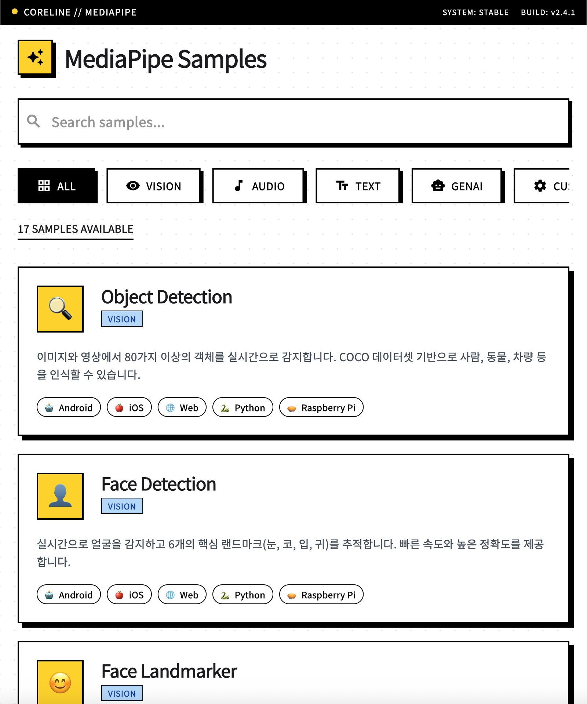

# MediaPipe 샘플 및 Flutter 런처


이 저장소는 공식 MediaPipe 샘플과 이를 쉽게 탐색하고 실행할 수 있는 **Flutter 런처 앱**을 제공합니다.

## 🚀 Flutter 런처 앱

이 저장소에 있는 17개 이상의 MediaPipe 머신러닝 샘플을 쉽게 탐색할 수 있도록 설계된 크로스 플랫폼 Flutter 애플리케이션입니다.

### 주요 기능
- **샘플 탐색**: 카테고리별(Vision, Audio, Text, GenAI)로 샘플을 탐색합니다.
- **검색**: 이름이나 설명으로 샘플을 빠르게 찾습니다.
- **플랫폼 지원 확인**: 각 샘플이 지원하는 플랫폼(Android, iOS, Web, Python, Raspberry Pi)을 확인합니다.
- **빠른 링크**: GitHub 소스 코드 및 공식 문서로 바로 이동합니다.

### 📱 스크린샷
<p align="center">
  
</p>

### 🛠️ 실행 방법

1. **사전 요구 사항**
   - Flutter SDK 설치
   - Xcode (macOS/iOS용) 또는 Android Studio (Android용)

2. **macOS에서 실행**
   ```bash
   cd mediapipe_launcher
   flutter run -d macos
   ```

3. **테스트 실행**
   ```bash
   flutter test
   ```

## 🔮 향후 로드맵 (Future Roadmap)

MediaPipe 샘플의 접근성을 획기적으로 개선할 계획입니다:
- **📱 안드로이드 원클릭 테스팅**: 안드로이드 기기에 직접 설치하여 실행할 수 있도록 지원합니다.
- **⚡ 즉각적인 기능 확인**: 컴파일 없이 간단한 터치만으로 특정 머신러닝 기능을 실행하고 검증합니다.
- **🌏 누구나 쉽게 접근 가능**: 복잡한 개발 환경 설정 없이 누구나 MediaPipe 샘플을 체험할 수 있도록 프로세스를 간소화합니다.

---

## 📂 원본 프로젝트 문서

> 아래는 Google AI Edge 저장소의 원본 README 내용입니다.

### 개요
이 저장소는 머신러닝 플랫폼으로 앱을 만드는 기본적인 단계를 보여주는 것을 목표로 하는 공식 MediaPipe 샘플을 호스팅합니다.

### 구성 요소
MediaPipe Solutions는 유연한 로우코드(low-code) / 노코드(no-code) 도구를 사용하여 온디바이스 ML 개발 및 배포를 간소화합니다:
* **MediaPipe Tasks** (low-code): 맞춤형 e2e ML 솔루션 파이프라인 생성 및 배포
* **MediaPipe Model Maker** (low-code): 고급 솔루션에서 맞춤형 ML 모델 생성
* **MediaPipe Studio** (no-code): 고급 프로덕션 수준 솔루션 생성, 평가, 디버그, 벤치마크, 프로토타입 및 배포

**참고**: 버그 수정을 위한 외부 PR은 환영하지만, 저장소의 유지 관리 단순성을 위해 새로운 샘플/데모 PR은 거부될 가능성이 높습니다.

[원본 README 읽기](README_ORG.md)

---

## 📜 라이선스

이 프로젝트는 **Apache License 2.0**에 따라 라이선스가 부여됩니다.

```text
Copyright 2022 The TensorFlow Authors.  All rights reserved.

Licensed under the Apache License, Version 2.0 (the "License");
you may not use this file except in compliance with the License.
You may obtain a copy of the License at

    http://www.apache.org/licenses/LICENSE-2.0

Unless required by applicable law or agreed to in writing, software
distributed under the License is distributed on an "AS IS" BASIS,
WITHOUT WARRANTIES OR CONDITIONS OF ANY KIND, either express or implied.
See the License for the specific language governing permissions and
limitations under the License.
```

자세한 내용은 [LICENSE](LICENSE) 파일을 참조하세요.
